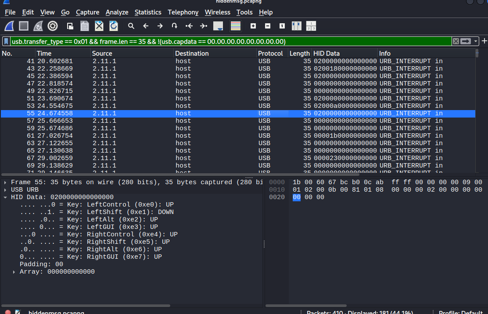
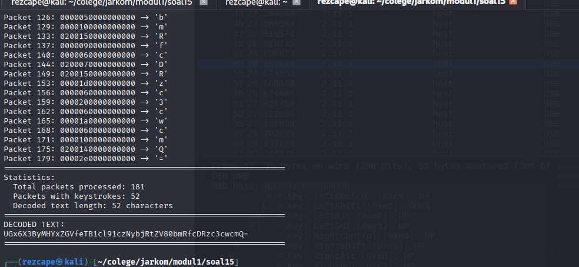
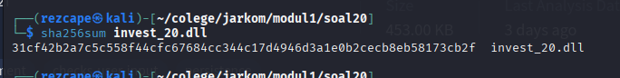

# 📄 Laporan Komdat Jarkom Modul 1 — 2025

## 👥 Anggota Kelompok

| Nama                     | NRP         |
|--------------------------|------------|
| Ahmad Syauqi Reza        | 5027241085 |
| Putri Joselina Silitonga | 5027241116 |

## Deskripsi Laporan 📝

Praktikum ini membahas konfigurasi jaringan dasar menggunakan router, switch, dan client untuk koneksi antar node dan internet. Dilakukan analisis keamanan jaringan melalui sniffing, FTP, upload/download file, simulasi serangan (ping flood & brute force), serta perbandingan Telnet dan SSH. Selain itu, dianalisis serangan Melkor seperti pencurian data, malware, dan email spoofing menggunakan file capture untuk identifikasi serta pencegahan ancaman. 

-------------------------------------------
# Soal 1 

Pada praktikum ini digunakan **GNS3 Web UI** dengan host IP `192.230.1.1`.  
Dibuat sebuah project dengan topologi sebagai berikut:

- **Eru** berperan sebagai **router utama**.  
- Router terhubung ke **internet** melalui **NAT1**.  
- Router juga terhubung ke **dua switch**.  
- Masing-masing switch kemudian menghubungkan **dua client**.

Struktur topologi ini dapat dilihat pada gambar berikut:  


----------

# Soal 2 
Agar **router Eru** dapat terkoneksi ke internet melalui **NAT1**, interface `eth0` dikonfigurasi untuk mendapatkan IP secara dinamis (DHCP):

```bash
auto eth0
iface eth0 inet dhcp
```
### Koneksi ke Switch (IP Statis)
### Interface ke Switch 1
```
auto eth1
iface eth1 inet static
    address 192.230.1.1
    netmask 255.255.255.0
```

### Interface ke Switch 2
```
auto eth2
iface eth2 inet static
    address 192.230.1.2
    netmask 255.255.255.0
```


# Soal 3
#### Konfigurasi Client (IP Statis)
Semua client menggunakan IP statis dengan gateway router yang sesuai.

### Client Switch 1 (Gateway: 192.230.1.1)
#### Melkor (192.230.1.3)
```
auto eth0
iface eth0 inet static
    address 192.230.1.2
    netmask 255.255.255.0
    gateway 192.230.1.1
```

#### Manwe (192.230.1.4)
```
auto eth0
iface eth0 inet static
    address 192.230.1.3
    netmask 255.255.255.0
    gateway 192.230.1.1
```

### Client Switch 2 (Gateway: 192.230.1.2)
#### Varda (192.230.1.5)
```
auto eth0
iface eth0 inet static
    address 192.230.2.3
    netmask 255.255.255.0
    gateway 192.230.2.1
```

### Ulmo (192.230.1.6)
```
auto eth0
iface eth0 inet static
    address 192.230.2.3
    netmask 255.255.255.0
    gateway 192.230.2.2
```


# Soal 4
Perintah yang ditambahkan pada file konfigurasi interface (up ...) untuk memastikan konfigurasi diterapkan setiap node dinyalakan.

#### Router Eru (NAT)
```
iptables -t nat -A POSTROUTING -s 192.230.1.0/24 -o eth0 -j MASQUERADE
```

#### Client (DNS)
```
echo -e "nameserver 8.8.8.8\nnameserver 1.1.1.1" > /etc/resolv.conf
```


# Soal 5 
Lakukan pengujian dari setiap client.

### Uji ping ke Gateway Switch 1
``ping 192.230.1.1
``

### Uji ping ke Gateway Switch 2
``ping 192.230.1.2
``

# Soal 6 

**Tujuan:**  
Melkor mencoba menyusup ke komunikasi antara **Manwe** dan **Eru**. Kita akan melakukan packet sniffing menggunakan file traffic yang diberikan, lalu memfilter paket berdasarkan IP Manwe (`192.230.1.3`).

---

###  Update sistem dan sertifikat
```bash
apt-get update
apt-get install -y ca-certificates openssl
update-ca-certificates
```
### Download file traffic.zip dari Google Drive
```
wget --no-check-certificate -O traffic.zip "https://drive.google.com/uc?export=download&id=1bE3kF1Nclw0VyKq4bL2VtOOt53IC7lG5"
```
### Filter paket dengan IP Manwe (192.230.1.3)
Display filter di Wireshark:
##### Hanya paket dari Manwe
```
ip.src == 192.230.1.3
```

#### Hanya paket menuju Manwe
```ip.dst == 192.230.1.3```


# Soal 7 - Konfigurasi FTP Server di Node Eru

Pada soal ini, kita diminta untuk membuat FTP Server di node **Eru** dan mengatur hak akses untuk dua user:  
- **ainur** → memiliki hak baca & tulis (`read & write`)  
- **melkor** → tidak memiliki hak akses sama sekali ke direktori `shared`  

Berikut langkah-langkah konfigurasi beserta pembuktian hak akses:

---

### Instalasi FTP Server
```bash
apt update
apt install vsftpd -y
```

### Backup konfigurasi vsftpd
```
cp /etc/vsftpd.conf /etc/vsftpd.conf.bak
```

### Konfigurasi vsftpd
Edit file /etc/vsftpd.conf
```
listen=YES
listen_ipv6=NO
anonymous_enable=NO
local_enable=YES
write_enable=YES
local_umask=022
chroot_local_user=YES
user_sub_token=$USER
local_root=/home/$USER/ftp
allow_writeable_chroot=YES
```

### Membuat user dan direktori FTP
User ainur dengan hak akses baca & tulis
```
adduser ainur
```
```
mkdir -p /home/ainur/ftp/shared
chown -R ainur:ainur /home/ainur/ftp
chmod 755 /home/ainur/ftp
```
```
chown -R ainur:ainur /home/ainur/ftp/shared
chmod 755 /home/ainur/ftp/shared
User melkor tanpa hak akses
```
``
adduser melkor
``

```
mkdir -p /home/melkor/ftp
chown -R melkor:melkor /home/melkor/ftp
chmod 755 /home/melkor/ftp
```

### Restart FTP Service
```
service vsftpd restart
```

### Uji akses user ainur
```
su - ainur
cd ftp/shared
echo "Halo dari ainur" > test.txt
exit
Hasil: File test.txt berhasil dibuat di direktori shared.
```

### Uji akses user melkor dari client FTP
```
ftp 192.230.1.1
```

### Login dengan user melkor
```
Name: melkor
Password: <password_melkor>
cd shared
# Hasil: Gagal mengakses direktori shared
# 550 Failed to change directory
bye
EOF
```


.png)


# Soal 8 

**Tujuan:**  
Ulmo, sebagai penjaga perairan, perlu mengirimkan data ramalan cuaca ke node **Eru** melalui FTP. Panduan ini berisi perintah bash lengkap dan instruksi Wireshark.

---

### Persiapan Node Ulmo
```bash
# Update paket & install FTP client
apt update
apt install -y vsftpd ftp
```
---
### Download file ramalan cuaca
```
wget --no-check-certificate 'https://drive.google.com/uc?export=download&id=11ra_yTV_adsPIXeIPMSt0vrxCBZu0r33' -O cuaca.zip
```
### Upload file ke FTP Server Eru
``` ftp 192.230.1.1 ```

#### Login dengan user ainur
``` Name: ainur
Password: <password_ainur>
```

#### Masuk direktori shared di server
`` cd shared ``

#### Upload file
`` put cuaca.zip ``

#### Keluar
`` bye
``
### Analisis FTP dengan Wireshark
Filter Wireshark:
#### Menampilkan semua paket FTP
``` ftp ```

#### Hanya perintah/request FTP
``` ftp.request ```

#### Perintah tertentu, misal upload/STOR
``` ftp.request.command == "STOR" ```

#### Sesi kontrol FTP (port 21) antara client dan server
``` tcp.port == 21 && ip.addr == 192.230.1.1 ```


# Soal 9 — FTP Download & User Access Control

Eru ingin membagikan **"Kitab Penciptaan"** kepada Manwe. File akan didistribusikan via FTP server di Eru, dengan user `ainur` dibuat **read-only**. Monitoring dilakukan menggunakan Wireshark untuk melihat perintah FTP yang dijalankan.

#### Unduh file ke node server Eru
``` wget --no-check-certificate "https://drive.google.com/uc?export=download&id=11ua2KgBu3MnHEIjhBnzqqv2RMEiJsILY" -O kitab_penciptaan.zip ``

#### 2. Konfigurasi vsftpd
Edit konfigurasi utama vsftpd
``` sudo nano /etc/vsftpd.conf ```

Pastikan ada / ubah entri berikut
``` write_enable=YES
 user_config_dir=/etc/vsftpd_user_conf
```

#### Buat direktori konfigurasi per-user
sudo mkdir /etc/vsftpd_user_conf

#### Buat konfigurasi khusus untuk user 'ainur'
sudo nano /etc/vsftpd_user_conf/ainur
Isi file:
``` # write_enable=NO
# download_enable=YES
```

#### Restart service vsftpd agar konfigurasi berlaku
``` sudo service vsftpd restart ```

#### 3. Download & Upload File via FTP dari node Manwe
``` ftp 192.230.1.1 ```
#### Login dengan user 'ainur' (atau user lain)
``` cd shared
get kitab_penciptaan.zip
put kitab_penciptaan.zip
```
#### Upload akan gagal karena write-disable

#### 4. Monitoring dengan Wireshark
```
Jalankan Wireshark di node pengamat / Manwe
Set display filter: ftp
Ikuti aliran perintah FTP: Follow → TCP Stream
```
### Gambar 9 (filter)


### Gambar 9 (read only)


# Soal 10 
---

## Cara menjalankan (di node **Melkor**)

TARGET="192.230.1.1"

#### 1) Baseline: 10 ping normal
``` ping -c 10 192.230.1.1 | tee /tmp/baseline_ping.txt
```

#### 2) ICMP Flood / Ping attack: 100 ping (normal count)
``` ping -c 100 192.230.1.1 | tee /tmp/attack_ping.txt ```


Ambil ringkasan
##### Paket & packet loss
```grep 'packets transmitted' /tmp/attack_ping.txt ```

##### Avg RTT
``` awk -F'/' '/rtt/ {print "attack avg RTT = "$5" ms"}' /tmp/attack_ping.txt ```


# 11. Persiapan Telnet Server (Melkor)

Update repository dan install Telnet daemon:
```bash
apt update
apt install -y inetutils-telnetd

Cek file binari Telnet:

ls -l /usr/sbin/in.telnetd
Lihat konfigurasi Telnet di xinetd:


cat /etc/xinetd.d/telnet
Restart service xinetd agar konfigurasi baru aktif:


service xinetd restart
``` 

#### Cek apakah port 23 Telnet sudah listening:
```
ss -tlnp | grep :23
cp -n /etc/inetd.conf /etc/inetd.conf.bak
grep -n "telnet" /etc/inetd.conf || true
```

#### Ubah semua referensi in.telnetd menjadi telnetd (safe):
``` sed -i.bak 's#/usr/sbin/in.telnetd#/usr/sbin/telnetd#g' /etc/inetd.conf ```
grep -n "telnet" /etc/inetd.conf

#### Restart service inetd agar konfigurasi baru diterapkan:
``` pid=$(pidof inetd)
kill -HUP $pid
```
#### Cek kembali apakah Telnet sudah listening di port 23:
``` ss -tlnp | grep :23 ```

#### Uji Koneksi Telnet (Eru → Melkor)
Dari node Eru, tes koneksi ke Telnet server Melkor:
``` telnet 192.230.1.2 ```
Jika berhasil, kamu akan masuk ke shell Telnet Melkor.


# Soal 12 — Pemindaian Port Sederhana (Eru → Melkor)

**Skenario singkat**  
Eru mencurigai Melkor menjalankan layanan terlarang di node-nya. Tugas: dari node **Eru**, lakukan pemindaian port sederhana menggunakan **netcat (nc)** untuk memeriksa port:

- **21 (FTP)** — harus **terbuka**
- **80 (HTTP)** — harus **terbuka**
- **666 (rahasia)** — harus **tertutup**

> IP target Melkor: `192.230.1.2`

---

## 1. Persiapan di node Melkor (JB — job/daemon start)
Pastikan layanan HTTP dan FTP berjalan di node Melkor (jalankan di Melkor):

```bash
# Start services sekarang
service apache2 start
service vsftpd start

# Aktifkan service pada boot
update-rc.d apache2 defaults
update-rc.d vsftpd defaults

# (Opsional) jalankan lagi untuk memastikan
service apache2 start
service vsftpd start
```

#### 2. Install Netcat di node Eru
Jika netcat belum terpasang di Eru, install salah satu varian:
``` apt update && apt install -y netcat-openbsd```


### 3.Pemindaian Port (dari Eru ke Melkor)
Gunakan opsi -v (verbose), -z (zero-I/O, port scan), dan -w 2 (timeout 2 detik):

#### Cek FTP (port 21)
nc -vz -w 2 192.230.1.2 21

#### Cek HTTP (port 80)
nc -vz -w 2 192.230.1.2 80

#### Cek port rahasia (port 666)
nc -vz -w 2 192.230.1.2 666


# Soal 13 — Amankan Koneksi Administratif dengan SSH (Varda → Eru)

**Skenario singkat**  
Setelah insiden penyadapan Telnet, semua koneksi administratif harus menggunakan **SSH**. Tugas: dari **node Varda** lakukan koneksi SSH ke **Eru**, tangkap sesi dengan Wireshark, dan analisis mengapa username/password tidak terlihat.

Target (contoh): `Eru = 192.230.1.1`, `Varda` sebagai client.  
User pada Eru: `windah` (atau sesuai soal).

---

## 1. Persiapan pada node Eru (install & enable SSH)

Jalankan di node **Eru**:

```bash
apt update
apt install -y openssh-server

# set password (contoh user basudara / sesuaikan)
passwd basudara

# tampilkan sebagian konfigurasi sshd untuk verifikasi
sed -n '1,200p' /etc/ssh/sshd_config | sed -n '1,200p'

# aktifkan password authentication (jika soal meminta)
sudo sed -i 's/^#\?PasswordAuthentication .*/PasswordAuthentication yes/' /etc/ssh/sshd_config

# enable & start ssh (baik systemd atau sysvinit)
which systemctl >/dev/null 2>&1 && systemctl enable --now ssh || service ssh start

# cek listener port 22
ss -tlnp | grep ':22' || netstat -tlnp | grep ':22'
```

2. Hapus host key lama (jika sebelumnya tersambung / key mismatch)
Jika muncul error host key changed dari client Varda, jalankan di Varda:
``` ssh-keygen -f '/root/.ssh/known_hosts' -R '192.230.1.1' ```
Lalu coba lagi koneksi SSH.

3. Dari node Varda: lakukan koneksi SSH ke Eru
```
ssh windah@192.230.1.1 ```
Masukkan password bila diminta (atau gunakan key-based auth sesuai pengaturan).

4. Menangkap sesi SSH dengan Wireshark
4.1 Mulai capture
Di mesin tempat lalu lintas melewati (mis. Varda) buka Wireshark dan mulai capture pada interface yang relevan (mis. eth0).

4.2 Terapkan filter layar (agar capture fokus ke sesi SSH)
Gunakan filter Wireshark:

tcp.port == 22 && (ip.addr == 192.230.1.1 || ip.addr == <IP_Varda>)
atau lebih singkat:


tcp.port == 22 && ip.addr == 192.230.1.1
Jika SSH berjalan di port non-standar ganti 22 sesuai port.
``` 


---

### Soal 14 ###

a. How many packets are recorded in the pcapng file?
Format: int
> 500358

Jumlah paket berada di pojok kanan bawah (sebelah profile: default).


b. What are the user that successfully logged in?
Format: user:pass
> nienna:y4v4nn4_k3m3nt4r1

User dan password yang berhasil login diketahui menggunakan filter `http.response.code == 200 && !(http.file_data contains "Invalid credentials")`.
Klik kanan pada paket -> follow > tcp streams.


c. Dari gambar (b) juga didapatkan letak credentials


d. Dari gambar (b) juga didapatkan user-agent yang digunakan.


flag: KOMJAR25{Brut3_F0rc3_1QhYSvBsCGwS0vgWLe77pqRun}

---

### Soal 15 ###

a. What device does Mellor use?
Format: string
> Keyboard

Gunakan filter `usb.bDescriptorType` untuk mencari device yang digunakan. Cari sampai menemukan type 3 atau string.


b. What did Melkor write?
Format: string
> Plz_pr0v1de_y0ur_us3rn4me_4nd_p4ssw0rd

Export semua file ke csv. Disini saya pakai file decoder dalam bentuk .py.


### Skrip Decoder HID ###
    import csv
    import sys

    class HIDDecoder:
    def __init__(self):
        """Initializes the decoder with USB HID code mappings."""
        # Peta untuk tombol biasa
        self.hid_map = {
            '04': 'a', '05': 'b', '06': 'c', '07': 'd', '08': 'e', '09':      
            'f', '0a': 'g',
            '0b': 'h', '0c': 'i', '0d': 'j', '0e': 'k', '0f': 'l', '10': 
            'm', '11': 'n',
            '12': 'o', '13': 'p', '14': 'q', '15': 'r', '16': 's', '17': 
            't', '18': 'u',
            '19': 'v', '1a': 'w', '1b': 'x', '1c': 'y', '1d': 'z', '1e': 
            '1', '1f': '2',
            '20': '3', '21': '4', '22': '5', '23': '6', '24': '7', '25': 
            '8', '26': '9',
            '27': '0', '28': '\n', '2c': ' ', '2d': '-', '2e': '=', 
            '2f': '[', '30': ']',
            '31': '\\', '33': ';', '34': "'", '35': '`', '36': ',', 
            '37': '.', '38': '/'
        }
               # Peta khusus jika tombol Shift ditekan
                self.shift_map = {
            '1e': '!', '1f': '@', '20': '#', '21': '$', '22': '%', '23': 
            '^', '24': '&',
            '25': '*', '26': '(', '27': ')', '2d': '_', '2e': '+', '2f': 
            '{', '30': '}',
            '31': '|', '33': ':', '34': '"', '35': '~', '36': '<', '37': 
            '>', '38': '?'
        }

    def decode_hid_data(self, hid_hex):
        """Menerjemahkan satu baris data hex dari keyboard."""
        # Data dari CSV Anda tidak pakai ':', jadi baris ini aman
        clean_data = hid_hex.replace(':', '')

        # Pastikan data cukup panjang
        if len(clean_data) < 8: # Cukup periksa 4 byte pertama (8 
        karakter hex)
            return None

        try:
            # Byte pertama (posisi 0-1) adalah modifier (Shift, Ctrl, dll.)
            modifier = int(clean_data[0:2], 16)
            # Byte ketiga (posisi 4-5) adalah tombol yang ditekan
            key_press = clean_data[4:6]
        except (ValueError, IndexError):
            return None # Abaikan jika format hex tidak valid

        if key_press == '00':
            return None # Tidak ada tombol yang ditekan

        # Cek apakah Shift ditekan (nilai modifier 2 atau 32)
        is_shift = modifier in [2, 32]

        if is_shift:
            # Gunakan shift_map, atau buat huruf jadi kapital
            char = self.shift_map.get(key_press, self.hid_map.get(key_press, '').upper())
        else:
            # Gunakan hid_map biasa
            char = self.hid_map.get(key_press, '')

        return char if char else f"[Unknown:0x{key_press}]"


    def decode_csv_file(self, csv_file):
        """Membaca file CSV dan menerjemahkan kolom 'HID Data'."""
        decoded_text = ""
        print(f"\n--- Menerjemahkan dari file {csv_file} ---")
        try:
            with open(csv_file, 'r', newline='', encoding='utf-8') as file:
                reader = csv.DictReader(file)
                for row in reader:
                    # Ambil data dari kolom "HID Data" dan bersihkan
                    hid_data = row.get('HID Data', '').strip().strip('"')
                    if hid_data:
                        char = self.decode_hid_data(hid_data)
                        if char:
                            decoded_text += char
            
            print("\n--- HASIL AKHIR ---")
            print(decoded_text)
            print("-------------------\n")

        except FileNotFoundError:
            print(f"Error: File '{csv_file}' tidak ditemukan!")
        except Exception as e:
            print(f"Terjadi error: {e}")
        return decoded_text
        
    def main():
    """Fungsi utama untuk menjalankan program."""
    decoder = HIDDecoder()
    
    # Langsung minta nama file CSV tanpa menu pilihan
    csv_filename = input("Masukkan nama file CSV (contoh: data.csv):   
     ").strip()
    if csv_filename:
        decoder.decode_csv_file(csv_filename)
    else:
        print("Tidak ada nama file yang dimasukkan. Program berhenti.")
        
    if __name__ == "__main__":
    main()
    
Maka akan keluar seperti ini:



c. Translate text base-64 ke plain text menggunakan cyberchef.


flag: KOMJAR25{K3yb0ard_W4rr10r_TIG4zQ6iduIi3f35miycN4A8J} 

---

### Soal 16 ###

a. What is the FTP password?
Format: string
> ind@psg420.com:6r_6e#TfT1p

Buka `Tools` -> `Credentials`. 
Follow tcp streams maka akan ditemukan user dan pass.


b. How many malware files are there?
Format: int
> 5

Filter menggunakan `frame contains “DOS mode”`.


Maka ada 5 file yang dicurigai mengandung malware[cite: 130].


Untuk nomor c - g didapat dari follow > tcp streams dari semua file yang dicurigain > save as raw file > `sha256sum <.fileexe>`.


c. What is the hash of the first file (q.exe)?
> ca34b0926cdc3242bbfad1c4a0b42cc2750d90db9a272d92cfb6cb7034d2a3bd

d. What is the hash of the second file (w.exe)?
> 08eb941447078ef2c6ad8d91bb2f52256c09657ecd3d5344023edccf7291e9fc

e. What is the hash of the third file (e.exe)?
> 32e1b3732cd779af1bf7730d0ec8a7a87a084319f6a0870dc7362a15dbd3199

f. What is the hash of the fourth file (r.exe)?
> 4ebd58007ee933a0a8348aee2922904a7110fb7fb6a316b1c7fb2c6677e613884

g. What is the hash of the fifth file (t.exe)?
> 10ce4b79180a2ddd924fdc95951d968191af2ee3b7dfc96dd6a5714dbeae613a


flag: KOMJAR25{Y0u_4r3_4_g00d_4nalyz3r_wFywVgOGK7XjRLyeZ6XSdr5o2} 

---

### Soal 17 ###

a. What is the name of the suspicious file?
> Invoice&MSO-Request.doc

`File` > `Export Objects` > `HTTP`. Maka akan ada 3 file.

 

Setelah ketiga file dicek di virustotal, file Invoice&MSO-Request.doc terindikasi mencurigakan.

 

b. What is the name of the second suspicious file?
> knr.exe

File kedua yang mencurigakan adalah knr.exe.

 

c. What is the hash of the second suspicious file?
> 749e161661290e8a2d190b1a66469744127bc25bf46e5d0c6f2e835f4b92db18

Dari virustotal terdapat keterangan hash dari file knr.exe.

 

flag: KOMJAR25{M4ster_4n4lyzer_PJ7yZZQBjcg29pO5E6woxOq6G} [cite: 137]

---

### Soal 18 ###

a. How many suspicious files are there?
> 2

Saya menggunakan filter `frame contains “.exe”` untuk mengetahui executable file yang ada. 

 

Terdapat 2 file smb terlihat mencurigakan karena namanya tidak biasa. Kemudian saya coba export dan lihat di virustotal dan terbukti.

 
 

b. What is the name of the first suspicious file?
> d0p2nc6ka3f_fixhohlycj4ovqfcy_smchzo_ub83urjpphrwahjwhv_o5c0fvf6.exe 

c. What is the name of the second suspicious file?
> oiku9bu68cxqenfmcsos2aek6t07_guuisgxhllixv8dx2eemqddnhyh46l8n_di.exe

d. What is the hash of the first suspicious file?
> 59896ae5f3edcb999243c7bfdc0b17eb7fe28f3a66259d797386ea470c010040 

 


e. What is the hash of the second suspicious file?
> cf9990bee6c378cbf56239b3cc38276eec348d82740f84e9d5c343751f82560

 

flag: KOMJAR25{Y0u_4re_g0dl1ke_top4c7cdz2fB7P9n5b5rd2y96} [cite: 146]

---

### Soal 19 ###

a. What is the string for the sender?
> Your Life

Gunakan filter `smtp.req.command == “MAIL”`. Ditemukan banyak email masuk yang mencurigakan. Setelah follow tcp streams muncul threatening message. Your Life adalah string untuk pengirim

 

b. How much money is the sender asking for?
> 1600$

 

c. What is the bitcoin wallet address?
> 1CWHmuF8dHt7HBGx5RKKLgg9QA2GmE3UyL

Alamat bitcoin wallet = 1CWHmuF8dHt7HBGx5RKKLgg9QA2GmE3UyL.

 

flag: KOMJAR25{Y0u_4re_J4rk0m_G0d_JQDdS87mZT7LpEZDN7hC8GdMz} 

---

### Soal 20 ###

a. What encryption is used by the user?
> TLSv1.2

Dari salah satu application data terlihat user menggunakan enkripsi TLS 1.2.

 

b. What is the name of the suspicious file?
> invest_20.dll

 

Karena diberikan file TLS Session Keys, maka langsung `Edit` → `Preferences` → `Protocols` → `TLS` untuk mendekripsi pesan tls. 

 
Export object -> html. Ada file suspicious yaitu invest_20.

 

c. What is the hash of that file?
> 31cf42b2a7c5c558f44cfc67684cc344c17d4946d3a1e0b2cecb8eb58173cb2f

Hash menggunakan `sha256sum`.

 

flag: KOMJAR25{B3ware_0f_M4lw4re_Dvr6ndMp5h9lMEm3DBLQu8xBU} 

---


